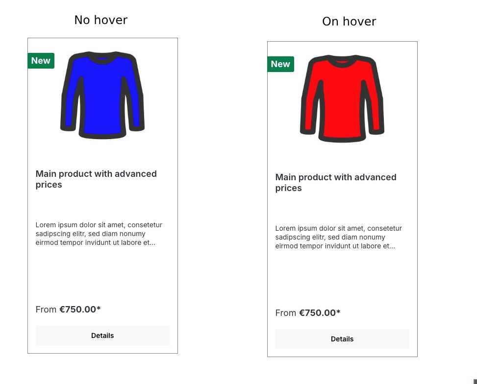
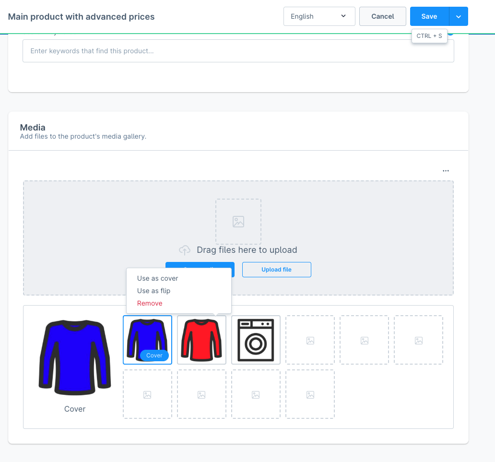
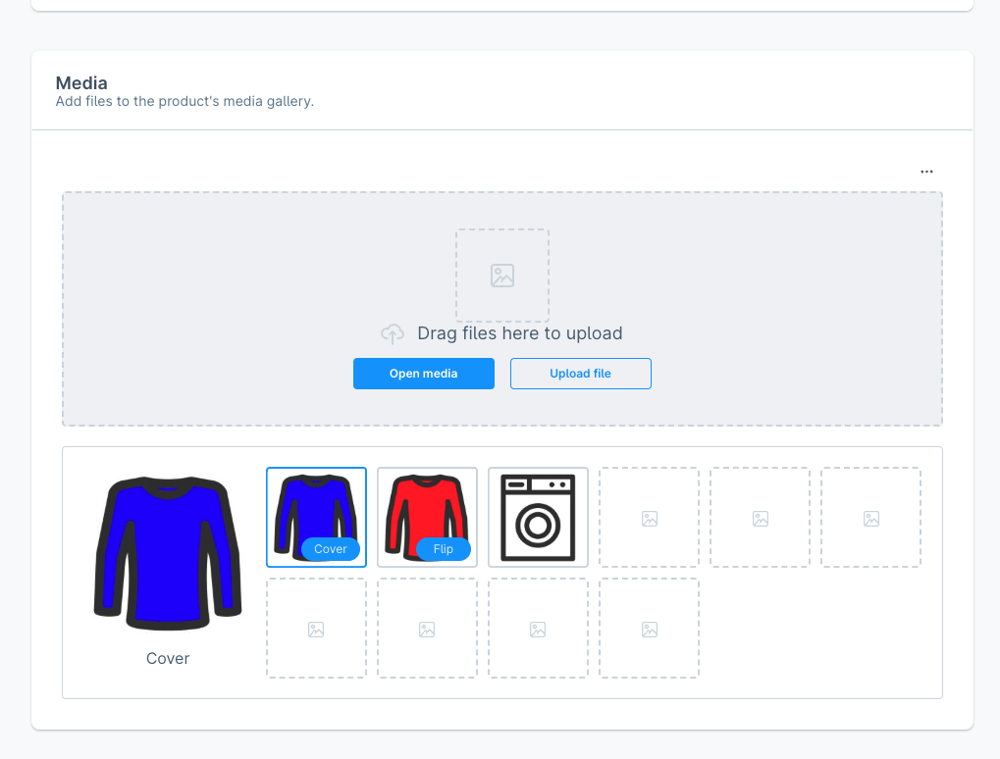

# Sidworks Product Flip Image for Shopware 6
This plugin allows you to assign a "flip" image to product media. When customers hover over a product image in the storefront, it automatically switches to the flip image—perfect for showing alternate angles or product variants.

## Images




## Installation
```bash
composer require sidworks/sw-plugin-product-flip-image
bin/console plugin:refresh
bin/console plugin:install --activate SidworksProductFlipImage
```
